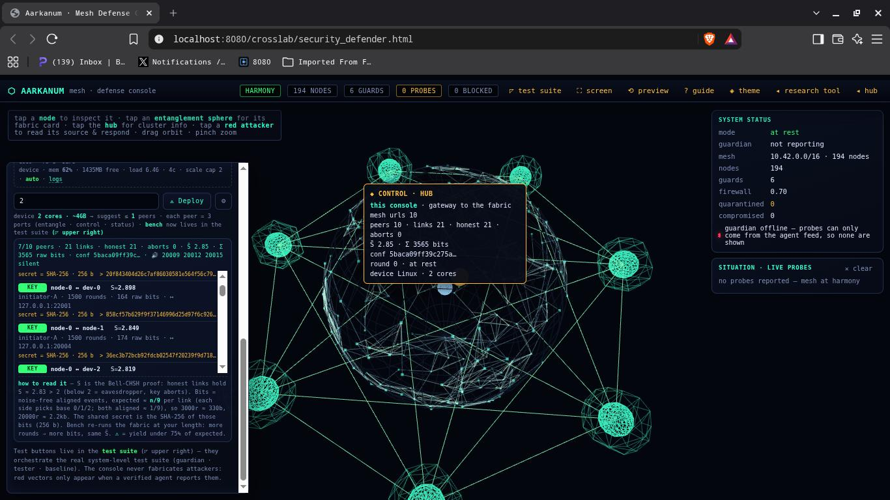

# ⬡ Aarkanum Laboratories — portable test bundle

Everything you need to run the lab **and** verify it on any device with Node.js ≥ 18
(Termux, Linux, macOS, Windows). No build step, no installs.

## The defense console



`app/crosslab/security_defender.html` — live ops view of a real mesh-defense run:
the streamdeck deck drives operations directly from the browser.

```
aarkanum-test/
├── app/          → the web app. Serve this folder, open in a browser.
│   ├── serve.js  → tiny static server (node serve.js) → http://localhost:8080
│   ├── experiments.html / index.html / landing.html / guide.html / readme.html
│   ├── exp-app.js · exp-core.mjs · gif-enc.mjs · elements.data.js
│   ├── crosslab/
│   │   ├── physics_simulator.html   → research tool (physics engine + security demo)
│   │   ├── security_defender.html   → defense console: live ops view + streamdeck deck + tap-inspect (nodes & real probes)
│   │   ├── secsim-core.mjs          → auto-generated shared engine (CFG + SpatialMap + Sim)
│   │   └── preview.html / README.md
│   └── lib/      → three.js r160 (vendored, includes OrbitControls etc.)
├── node-tests/   → headless self-check: DOM+WebGL fakes, no browser needed
│   ├── ui-harness.mjs   → fake document/canvas/WebGL harness
│   ├── exp-app.mjs · exp-core.mjs · gif-enc.mjs · elements.data.js (same code as app/)
│   ├── sync-seccore.mjs → regenerates app/crosslab/secsim-core.mjs from physics_simulator.html
│   ├── defense-tool.mjs → CLI security-playbook runner against the shared engine
│   ├── mesh-guardian.mjs → defense agent (the system): rate-limits & repels flood vectors, HTTP /status for the console
│   ├── mesh-tester.mjs   → offense suite for your own devices (syn-slew/snaplag/udp-amp/pscan), A/B verdict
│   ├── mesh-control.mjs  → raw baseline: same listening surface, no defense ("system NOT running")
│   ├── mesh-selfcheck.mjs→ one-device A/B: system ON vs OFF, real loopback probes
│   ├── node_modules/    → three r160 for Node resolution
│   └── *.mjs            → the probes below
└── selfcheck.mjs → runs every probe, prints PASS/FAIL per suite
```

## Quick start — visual (needs a browser)

```bash
cd app
node serve.js          # → http://localhost:8080
```
Then open `http://localhost:8080` (or `http://<this-device-IP>:8080` from
any phone/tablet on the same Wi-Fi) and tap **⚡ Experiments** → the lab.

**Entanglement fabric across devices (the console's live fabric row):** the same
`serve.js` auto-boots `peer-supervisor.mjs` (tier-1 watchdog on :22100), which by
default also adopts every physically-attached adb phone (`--devices all`) as
`dev-<i>` and meshes them with the host census — full K-mesh, every link KEY.
**⟑ Launch deploys the field count on EVERY phone**: with `N` in the deck, the
supervisor ensures `N` census peers (`node-0..N-1`) AND spawns `N` entangled
peers per attached device (`dev-<i>-0 .. dev-<i>-<N-1>`), so an `N=6` with four
phones up = 6 host + 24 device peers. Each device peer is a plain `entangle-peer.mjs`
instance run through the phone's `launch.sh`; kills are scoped per `--name` (the
phone may run many peers — a blanket `pkill -f entangle-peer` would drop them all).
Two gotchas (both fixed inside the supervisor): every phone needs **`adb reverse`**
routes for the host ent ports or its outbound dials ECONNREFUSED (the seed exits 1,
phones sit at 0 links), and the seed must pass **explicit `ent:ctl`** pairs (the
parsePeers `ctl = ent + 1000` default is wrong for the 2000x/2200x families, where
control = ent + 1).

**Port families** (each peer = 3 consecutive ports; device peers share a running
global host index `g` across all phones):

| slot | family | ent · ctl · sta | device-side |
|---:|:---|:---|---:|
| host node-*i* | `2000x` | `20001+3i` · `+1` · `+2` | — |
| adb dev-*i*-*k* | `2200x` (host) | `22001+3g` · `+1` · `+2` | ent `7200+10i+k` · ctl `8200+10i+k` · sta `9200+10i+k` |
| qkd-selfcheck sandbox | `2600x` | `26001+3i` · `+1` · `+2` | — |

ES modules + an import map require HTTP — do **not** open `experiments.html` via `file://`.

A second serve instance can mirror the GitHub-Pages layout (`/app/crosslab/...`) while
sharing the same supervisor — useful as a LAN console with the live `/peerctl` proxy:

```bash
PORT=8099 SERVE_ROOT=$PWD node app/serve.js   # http://this-host:8099/app/crosslab/security_defender.html
```

The console also reconciles its mesh poll list from supervisor status, so census st
ports (e.g. `20012/20015` when auto-scale retires to 3 peers) stop being polled and
throwing connection-refused noise.

## Defense console on a static host (no Node reachable)

`security_defender.html` detects whether it is being served from a **static host**
(`https:` GitHub Pages, any non-localhost LAN origin, or `file://`) and degrades to
an honest, self-contained **in-browser E91 fabric** — it no longer fakes a phantom
mesh. When it cannot reach the node supervisor or the `2000x`/`2200x` ent peers:

- **Readouts stay truthful** — `0/0`-style claims are gone; the fabric row shows
  `fabric idle — press ⟠ Entangle` until you act, and the mesh-url input is cleared
  with a "no node hosts reachable" hint instead of seeded localhost URLs.
- **The fabric buttons genuinely compute** — ⟠ Entangle, ⇆ Rotate, ⚑ Eve,
  ⚥ Deploy, the supervisor Start/Stop/Watchdog row, and Bench run the same E91
  math (Bell-CHSH S, noise-free aligned-bit sifting → SHA-256 shared secret) entirely
  in-page via `secsim-e91.mjs`. No server, no data collection, TOS-safe on Pages.
  Every button does exactly what it does in the live dev build — nothing is
  fabricated until you press it.
- **Mobile gets a start menu** — on screens ≤ 760px the top-bar pills/links collapse
  into a ☰ **⬡ START** drawer holding the live readouts and nav links plus a
  expand/collapse-streamdeck control (no more duplicate button grids — the always-
  visible streamdeck is the single source of truth). The deck also gets a ▾ collapse
  toggle (persisted; default collapsed on mobile).
- **Opt out/force** for testing: `?static=1` forces the in-browser fabric,
  `?static=0` forces the live-backend path.

### Physical devices vs entangled peers (3D)

The fabric view draws **two concentric bands** around the operator's host globe:

- inner (teal wireframe spheres, radius 1.62×globe) — **entangled peers** `node-*`
  (host/simulated, running the E91 emitter) cluster around the operator's globe;
- outer (solid gold octahedra + thin cage, radius 2.30×globe) — **one chassis per
  physical phone** `dev-<i>`, and each phone's own entangled peers `dev-<i>-<k>`
  (small pale-teal spheres) wheel around **that** chassis in a satellite bead
  (radius ~0.42×globe) — so a `--dev-per 10` phone reads as one gold device
  wearing a little cloud of 10 entangled peers, exactly like the host wears
  `node-*`. A faint amber ring guide marks the chassis band so the two bands read
  at a glance.

**The angel** — the outer ring is not a static torus. Its peer meshes live in a
dedicated `efPhysGroup` child of the fabric group, and each frame the controller
gives it a full **orbit** (`rotation.y` accumulation) plus a **progressive tilt
whose axis itself swings** — `rotation.z` rocks side-to-side and `rotation.x`
fore-aft on slow phases. The net effect is a wheel that precesses through the
field instead of spinning in a flat plane, literally "a wheel within a wheel."

**The draw is a ring lattice, not a chord graph.** The fabric's real mesh is
*complete* (every peer pairs with every other — see `simulateMesh`), but drawing
all chords with 50 peers on two radii turns into a spiderweb of lines stretched
across the whole system. So the console draws **nearest-neighbour coils**: ring 1
connects `node-*` to its ring neighbours (±1, ±2) around the host; ring 2 does
the same for the phone chassis; each phone additionally wears a mini-coil
satellite ring plus a short spoke from every `dev-<i>-<k>` to its own chassis.
The real telemetry stays honest — the summary line and hub card still report the
true link / CHSH / bits counts from the fabric, and a drawn edge picks up its
real KEY/ABORT verdict when that pair exists in the actual mesh. Because the
rings are in motion, the spokes are re-solved every frame: each drawn edge's
endpoints are taken from the meshes' true world positions and folded back into
the fabric group via `worldToLocal`, so the coils chase the sweeping, tilting
ring rather than tearing away from it.

**The topology is always visible, even keyless.** `updateEntFabric` unions the
supervisor's *discovered* peer list (census pairs + enumerated device peers from
`/peerctl` status) with any links the E91 peers report — so the full 10-node
coil, all chassis, and every phone's satellite ring render the moment the
operator presses ⟑ Launch, whether or not a seed has produced links yet. This
directly fixes the old "pressed Entangle, nothing popped up" failure, which was
caused by a *keyless* mesh: the supervisor seeded every known peer in one shot
(host + device), and `qkd-cluster` treats a single refused connect as fatal — one
stale adb forward (a rebooted phone) therefore nuked the *entire* fabric and the
console had zero links to draw. The supervisor now **seeds only currently-live
peers** (`p.up && !quarantined`, bails logging "fewer than 2 live peers"), so a
single downed peer can no longer key the mesh; that peer simply joins on a later
round once its forward is healthy.

Clicking either type opens an **honest** card: `◆ PHYSICAL DEVICE` vs
`◆ ENTANGLED PEER`, and it reports real telemetry from the current fabric (its `KEY`
verdicts, Bell-CHSH S, round count, bits) read straight from the mesh state — the old
"status unreachable — peer may be down" hover result on a peer with no live URL is
gone (a quick, bounded server probe still adds uptime when a node host is reachable).

The default camera orbit now zooms out to `maxDistance = 70` (was 30) and the first
launch/entangle eases the view out to frame both bands.

### Streamdeck launch + bench

- **Min / Med / Max** quick-launch buttons set the peer-count field (2, the
  hardware-recommended count, or 24) and run an immediate deploy; **⟑ Launch in
  the live build deploys that count on the host AND per attached phone** (the
  honest log line says so: *"N entangled peers on EACH of M phone hosts (the
  angel outer ring)"*); the **⚙** hardware
  scan now does something visible too — it writes the recommended count into the
  field (amber flash) instead of only logging.
- The fabric **bench has its own field in the deck** (`rounds` input + ⟳ Bench).
  It stays in lockstep with the test-suite field (`b` hotkey lands here now), so
  launching, entangling, and benching all use the one value you typed.
- The ☰ start menu no longer duplicates the streamdeck (see above).

The full live path (supervisor + adb device mesh) is unchanged when `security_defender.html`
served locally next to `serve.js` — see "Entanglement fabric across devices" above.

## Quick start — headless self-check (needs only Node)

```bash
node selfcheck.mjs
```
Expected: `PASS` on all 20 suites, ending with `SELFCHECK-OK: 20/20 green`.

> The entanglement gate (`qkd-selfcheck.mjs`) runs on its own sandbox port base
> (2600x) so it never collides with a live fabric — it is safe to run while the
> supervisor + phones are up.

Or run one suite directly:
```bash
cd node-tests
node run.mjs            # boot + 40 physics frames of the salt experiment
node scanning-probe.mjs # MRI orbit + clip export (16-frame filmstrip + anim player + GIF)
node gif-probe.mjs      # GIF89a codec round-trip + app clip export writes .gif
node player-probe.mjs   # clip player infocard: frames + full run data + print syntax check
node laserwire-probe.mjs # beam wireframe source geometry + settings toggle + cage-following particles
node geom-probe.mjs     # 20-experiment deploy sweep + dossier feeder + 26-mount beam bank
node inst-probe.mjs     # instruments: chart · spec · recipe · stage · lab book · import
node custom-probe.mjs   # custom experiments: save → command centre + picker + cross-wall tile + delete
node player-probe.mjs   # clip player infocard: frames + full run data embedded + SOM script syntax
node mesh-selfcheck.mjs # defense A/B: system ON vs OFF on 127.0.0.1, real probes
node qkd-selfcheck.mjs  # 4-node entanglement fabric (E91): pairwise Bell-CHSH + conference key + Eve abort + stealth-Eve leak probe
node agent-pen.mjs      # agentic autonomy pen bench: rogue impostor + control-API abuse + /e91 fuzz + forged-telemetry rejection
node tls-hybrid.mjs     # PQ-hybrid TLS gate: AEAD+PFS-only floor, TLSv1.2 downgrade rejection, X25519MLKEM768 negotiable
node sweep-novel.mjs    # novel-vector sweep: 3 unseen attack shapes (jittered flood / overdrive / telegr) — behavior repels more than baseline
```
`ui-harness.mjs` fakes DOM/canvas/WebGL, so the lab boots and runs its full
wiring (handlers, MRI maps, beam physics, feeder, deploy pipeline) with zero GUI.

## What the probes cover

| probe | proves |
| --- | --- |
| `run.mjs` | page boots, tap + input events process, frames render, no exceptions |
| `grid-test.mjs` | experiment menu lists 20, picking works, cross-wall A/B tiles lock rates & seed |
| `parts-probe.mjs` | tap-inspect, settings handlers, overlay modes, HUD scale, part modal |
| `mods-probe.mjs` | 7 moveable UI modules, drag + edge snap; the MRI scanner spawns docked under the top bar (flush left, gap) and stale positions that land on/above the bar are re-docked; the chamber-scan minimap spawns mid screen (~80px below centre), honours real drag spots, discards stale corner saves, and hidden modules never persist zero rects |
| `overlay-probe.mjs` | modals clamp/fold/Esc chain, shape switches keep atoms in-bounds |
| `rate-probe.mjs` | speed stepper 0.01 fs → 3.2 T y, HUD time truth |
| `settings-probe.mjs` | settings buttons, agents round-trip |
| `scanning-probe.mjs` | MRI orbit 0/90°, all-axis map, clip record→16 frames→save reset |
| `geom-probe.mjs` | 6 tube shapes, TIME_BANDS, dossier feeder presets, 20-experiment deploy sweep (0 escaped atoms), 26-mount beam bank + traverse offsets + rig spinner counts |
| `inst-probe.mjs` | instruments: chart · spec · recipe · stage · lab book · import |
| `gif-probe.mjs` | hand-rolled GIF89a codec (NETSCAPE loop, GCE alpha, 9→11-bit LZW) round-trips idempotently; `exportClipFilm` writes `.png` + `.gif` |
| `laserwire-probe.mjs` | 3D wireframe laser-head at each firing beam (settings toggle flips it, 12-box pool), and spawned particles are pinned inside the internal geometry cage |
| `custom-probe.mjs` | custom experiments: save → command centre + picker + cross-wall tile + delete |
| `player-probe.mjs` | clip player infocard: frames + full run data embedded + SOM script syntax |
| `sync-seccore.mjs` | **shared-engine guard**: `--check` proves `app/crosslab/secsim-core.mjs` is in sync with `physics_simulator.html`, and `--smoke` boots the generated engine to verify attacker-source telemetry, node quarantine/release and manual defender deployment all work end-to-end |
| `mesh-selfcheck.mjs` | **real defense A/B**: raises a guardian (system ON) and a raw baseline (system OFF) on loopback, drives identical probes from `mesh-tester.mjs`, and proves `repel(guardian) > repel(baseline)` (6384 events: 20.3% blocked with system ON, 0% without) |
| `qkd-selfcheck.mjs` | 4-node entanglement fabric (E91): pairwise Bell-CHSH + conference key + Eve abort + stealth-Eve leak probe |
| `agent-pen.mjs` | agentic autonomy pen bench: rogue-port impostor + control-API abuse + /e91 fuzz + forged-telemetry rejection vs peer-supervisor (52/52 invariants held) |
| `tls-hybrid.mjs` | PQ-hybrid TLS gate: AEAD+PFS-only floor, TLSv1.2 downgrade rejection, X25519MLKEM768 hybrid loopback negotiable |
| `sweep-novel.mjs` | novel-vector sweep: 3 unseen attack shapes (jittered flood / overdrive / telegr) — behavior repels more than baseline |

## Real device security test suite

The defense console is the *actual tool* on a real network: attackers only ever
appear from probes a **verified agent reports** — it never fabricates them. Run
the suite across your own devices:

```bash
# Device B — runs the system (defended target)
node node-tests/mesh-guardian.mjs --listen 7171 --status 7172
# then open security_defender.html with agent URL http://<B-IP>:7172/status → watch repels live

# Device A — attacker (does NOT run the system)
node node-tests/mesh-tester.mjs --target <B-IP> --port 7171 --vectors syn-slew,snaplag,udp-amp --rate 40 --count 400

# Device B again — prove the "without running the system" leg
node node-tests/mesh-control.mjs --listen 7173
node node-tests/mesh-tester.mjs --target <B-IP> --port 7173 --vectors syn-slew,snaplag,udp-amp --rate 40 --count 400 --baseline
```

The guardian rate-limits and refuses flood vectors from userspace (no firewall
claims), counts every event, and exposes `accepted / blocked / recent` as JSON at
`/status` (CORS-open) for the console's live situation board. Trafic stays on
your own LAN; testing refuses non-private targets unless `--force`.

## GIF export

`exportClipFilm` writes a **client-side GIF89a** (`.gif`) next to the PNG filmstrip
and anim player — no network, zero dependencies. The GIF now downloads directly like
the PNG (plus the raw frames manifest), so it reaches you even without File System
Access. Also saved: `<base>-frames.json` raw RGBA frames, re-encodable headlessly
with the bundled CLI:

```bash
node mri2gif.mjs <base>-frames.json [out.gif]   # → 4-frame GIF, same codec as the app
```

The 3-bits-red/3-bits-green/2-bits-blue palette + LZW encoder are a faithful port of
giflib's `EGifCompressLine` (codes emit at the current width; the width raises only
when `freeEnt >= (1 << nBits)`, keeping the encoder dict exactly one entry ahead of
the decoder). GIFs decode back to the same indices byte-for-byte, including across
the 9→10→11→12-bit boundaries.

## Sharing to another real device

1. Copy `aarkanum-test.tar.gz` over (scp/sftp, `adb push`, local Wi-Fi file drop, USB…).
2. Extract: `tar -xzf aarkanum-test.tar.gz` (Windows 10+: `tar -xzf` works in PowerShell/cmd).
3. `node selfcheck.mjs` to prove the port, then `cd app && node serve.js` and open from the browser.
4. Devices without Node can still use the app — serve the `app/` folder from anything
   (`python3 -m http.server 8080`, nginx, a static-hosting site) and browse.

Requires Node ≥ 18 only for `serve.js` / the self-check; the web app itself is plain ES modules + three.js.